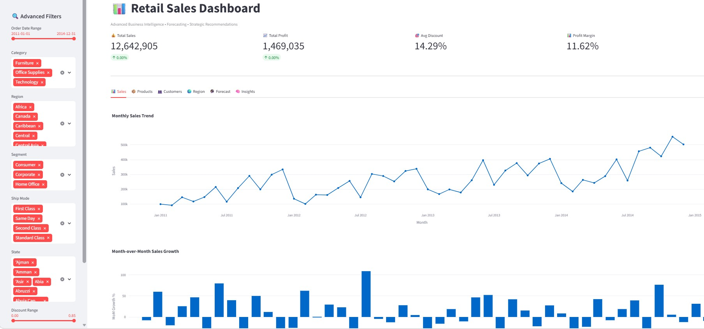

# 📊 Retail Sales Analytics, Forecasting & Business Intelligence Platform

## 🚀 Project Overview

This project is a production-grade **Retail Sales Analytics, Forecasting, and Strategic Decision Intelligence Platform** built with Python and Streamlit.

It transforms raw retail transaction data into:

* 📈 Sales performance analytics
* 💰 Profitability optimization insights
* 👥 Customer segmentation intelligence
* 🌍 Regional and operational performance analysis
* 🎯 Discount and pricing strategy recommendations
* 🔮 Future sales forecasting
* 📄 Executive reporting dashboards

### 💼 Core Objective:

Enable retail businesses to make smarter, data-driven decisions using advanced analytics, forecasting, and business recommendations.

---

# 🌐 Live Dashboard (Streamlit App)

```bash
https://vidhi-jajodia-retail-sales-analysis.streamlit.app
```

---

# 📸 Dashboard Preview

## Executive Dashboard



## Next Month Sales Forecast


---

# 🎯 Business Challenges Solved

Retail organizations often struggle with:

* Identifying profitable vs loss-making products
* Understanding discount leakage
* Recognizing top customers and segments
* Measuring regional profitability
* Tracking sales growth trends
* Forecasting future demand
* Creating strategic recommendations from data

### ✅ This system addresses all these challenges through an end-to-end analytics pipeline.

---

# 🧠 Solution Architecture

## 1️⃣ Data Engineering & Cleaning

* Cleaned and processed ~50K+ transactional records
* Standardized date formats, product hierarchies, and customer fields
* Missing value treatment
* Numeric normalization
* Feature engineering for forecasting and segmentation

---

## 2️⃣ Exploratory Data Analysis (EDA)

### Includes:

* Sales trends
* Category performance
* Sub-category profitability
* Discount analysis
* Customer behavior
* Regional sales patterns
* Segment analysis
* Product profitability

---

## 3️⃣ 👥 Customer Segmentation (RFM Analysis)

Customers classified into:

* Champions
* Loyal Customers
* Potential Loyalists
* At-Risk Customers
* Lost Customers

### Business Value:

* Improved marketing targeting
* Retention campaigns
* Customer lifetime value optimization

---

## 4️⃣ 💰 Profitability Optimization Engine

### Insights generated:

* Loss-making products
* High discount leakage categories
* Underperforming regions
* Margin analysis
* Product pricing weaknesses

### Recommendations:

* Discount reduction
* Pricing optimization
* Regional operational improvements
* Product portfolio refinement

---

## 5️⃣ 🔮 Forecasting System

### Current Model:

* Linear Regression
* Lag Features
* Rolling Mean Features
* Trend + Seasonality Features

### Forecast Outputs:

* Next month sales prediction

---

# 📊 Dashboard Features

## 🔍 Advanced Filters

Users can dynamically filter by:

* Date range
* Category
* Region
* Segment
* Ship Mode
* State
* Discount range
* Sales range
* Product search

---

## 📈 Visual Analytics Modules

### Included Dashboards:

### 📊 Sales Analytics

* Monthly sales trends
* MoM growth
* Discount leakage scatter analysis

### 📦 Product Intelligence

* Top products
* Treemap category performance
* Loss-making products

### 👥 Customer Analytics

* Top customers
* Segment performance
* Revenue concentration

### 🌍 Regional Analytics

* Region sales comparisons
* Profitability benchmarking
* Underperformance detection

### 🔮 Forecasting

* Sales trend projection
* Future revenue estimation

### 🧠 Strategic Insights

* Auto-generated business insights
* Operational recommendations
* Risk flags

---

# 📄 Generated Outputs

| Output File                   | Description              |
| ----------------------------- | ------------------------ |
| `outputs/insights.txt`        | Strategic insights       |
| `outputs/recommendations.txt` | Business recommendations |
| `outputs/sales_forecast.csv`  | Forecast prediction      |
| `filtered_sales_data.csv`     | Dashboard export         |

---

# 📊 Key Business Insights Examples

* Top customer segments drive majority revenue
* Excessive discounts reduce profitability
* Certain sub-categories consistently underperform
* Regional disparities impact margins
* Seasonal sales trends influence planning
* Forecasted demand supports inventory decisions

---

# 🎯 Strategic Recommendations Examples

* Reduce discounting in low-margin categories
* Optimize pricing strategy
* Focus investment on profitable customer segments
* Improve logistics in weak regions
* Phase out consistently loss-making products
* Expand high-performing product categories

---

# 🛠️ Tech Stack

### Core:

* Python
* Pandas
* NumPy

### Visualization:

* Plotly
* Matplotlib
* Seaborn
* Streamlit

### Machine Learning:

* Scikit-learn

### Reporting:

* CSV exports
* Forecast outputs
* Dashboard recommendations

---

# 📂 Project Structure

```bash
retail-sales-analysis/
│
├── data/                        # Raw dataset
├── outputs/                     # Forecasts, insights, recommendations
├── screenshots/                 # Dashboard visuals
│
├── src/
│   ├── data_loader.py
│   ├── cleaning.py
│   ├── analysis.py
│   ├── forecasting.py
│   ├── visualization.py
│   ├── insights.py
│
├── StreamlitApp.py              # Advanced Streamlit dashboard
├── main.py                      # Full analytics pipeline
├── requirements.txt
└── README.md
```

---

# ▶️ Installation & Execution

```bash

## Steps:

### 1. Clone the repository.

### 2. Navigate to project
cd retail_sales_analysis_python

### 3. Install dependencies
pip install -r requirements.txt

### 4. Run analytics pipeline
python main.py

### 5. Launch dashboard
streamlit run StreamlitApp.py
```

---

# 🏆 Portfolio / Resume Highlights

This project demonstrates:

### Technical Skills:

* Data cleaning & preprocessing
* Feature engineering
* Business intelligence analytics
* Forecast modeling
* Dashboard development
* Strategic recommendation systems
* Customer segmentation

### Business Skills:

* Revenue optimization
* Margin improvement
* Operational analysis
* Strategic planning
* Executive reporting

---

# 🔮 Future Enhancements

### Planned Upgrades:

* 🤖 AI-generated narrative insights
* 📄 PDF executive reports
* 🌍 Geographic maps
* 🧠 Customer churn prediction
* 📦 Inventory optimization

---

# 👨‍💻 Author

## Vidhi Jajodia

### Connect:

* GitHub: [vidhi-jajodia](https://github.com/vidhi-jajodia)
* LinkedIn: [vidhi-jajodia](https://www.linkedin.com/in/vidhi-jajodia/)

---
